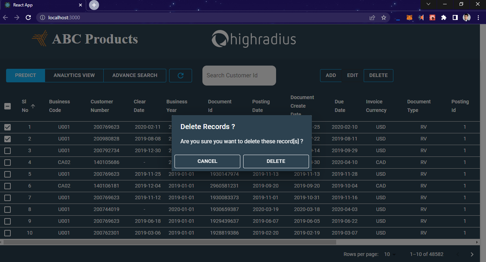
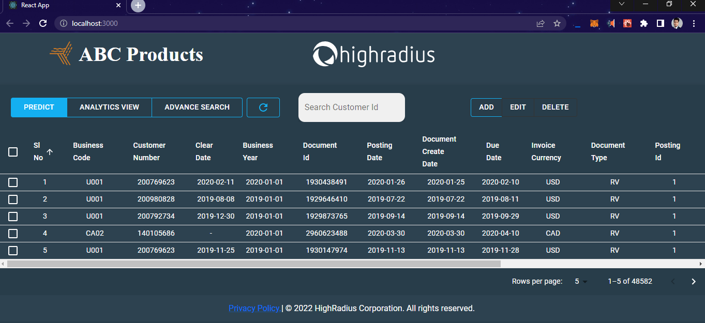

# AI-Enabled FinTech B2B Invoice Management Application

- A Full-stack Invoice Management Application using JDBC, Java, Servlets.
- **Responsive** Receivables Dashboard.
- **Visualize Data** in form of grids.
- **Visualize Data** in form of graphs.
- Perform **Searching** operations on the invoices.
- **Add & Edit data** in the editable fields of the grid.
- **Pagination**
- Invoice CLearing date **Prediction**
- **Sorting columns**
- **View Analytics**

<h3>Screenshots</h3>

  
Grid Data Loading

  

  
Crud Operations

  
  
  
  
  

  
Pagination

  
  

  
Advanced Search

  <h2>Advanced Search - Dialog Input</h2>
  
  <h2>Advanced Search - Result</h2>
  

  
Grid Reloading

  <h2>Grid Data Reloading - Before Click</h2>
  
  <h2>Grid Data Reloading - After Click</h2>
  

  
Predict Button ML Integeration

  <h2>Predict Button - Inactive</h2>
  
  <h2>Predict Button - Active</h2>
  
  <h2>Predict Button - Clear Date Prediction</h2>
  
  <h2>Predict Button - Aging Bucket Prediction</h2>
  

  
Shortcut search button on Grid for Customer Id

  <h2>Shortcut search button for Customer Id</h2>
  

  
Sorting Columns

  <h2>Sorting - 01</h2>
  
  <h2>Sorting - 02</h2>
  

  
View - Analytics

  <h2>Analytics Form</h2>
  
  <h2>Analytics Form (Invoice Currency Multiselect)</h2>
  
  <h2>Analytics Bar Chart</h2>
  
  <h2>Analytics Pie Chart</h2>
  
  <h2>Analytics View Close Button</h2>
  

